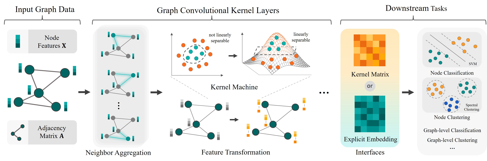

Graph Convolutional Kernel Machine
====
This is the implementation of GCKM proposed in our paper:

Zhihao Wu, Zhao Zhang, and Jicong Fan*. [Graph Convolutional Kernel Machine versus Graph Convolutional Networks](https://openreview.net/forum?id=SFfOt1oDsX), NeurIPS 2023.



## Requirement

  * Python = 3.9
  * PyTorch = 1.11
  * Numpy = 1.21
  * Scikit-learn = 1.1
  * Scipy = 1.8
  * Networkx = 2.8
  * Tqdm = 4.64

## Quick Start
Unzip the dataset files
```
unzip ./data/datasets.7z
```
then run 
```
python node_classification.py --dataset Cora
```
for node classification task,
```
python node_clustering.py --dataset Cora
```
for node clustering task,
```
python graph_classification.py --dataset MUTAG
```
for graph classification task,

Note that the default parameters may not be the best to reproduce our results in the paper.

## Dataset

### Node-level
  * Cora
  * Citeseer
  * Pubmed
  * ACM
  * Actor
  * Chameleon
  * CoraFull
  * Squirrel
  * UAI

### Graph-level
  * COLLAB
  * IMDBBINARY
  * IMDBMULTI
  * MUTAG
  * PROTEINS
  * PTC

Saved in ```./data/node level.7z``` and ```./data/graph level.7z```

*Note: (1) Please unzip the datasets folders first; (2) Random data splitting function can be found in Dataloader.py; (3) Please feel free to contact me for codes regarding OGB-Arxiv (due to the large file)*
